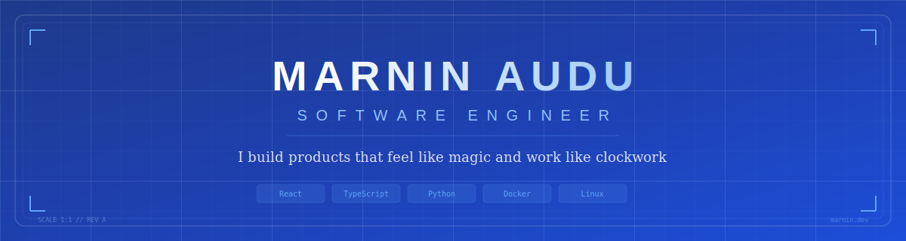

<p align="center">
  
</p>

<p align="center">
  <a href="https://marnin.dev"></a>
  <a href="https://linkedin.com/in/marnin-a-agyubok"></a>
  <a href="https://twitter.com/marnin_a"></a>
  <a href="mailto:msmaudu@gmail.com"></a>
</p>

---

## About Me

Software Engineer at, building customer-facing web applications and scalable infrastructure. CS graduate from Air Force Institute of Technology, Kaduna.

I'm passionate about creating **software solutions that just work**.

---

## Tech Stack

### Frontend
<p align="left">
  
  
  
  
  
  
  
</p>

### Backend
<p align="left">
  
  
  
  
  
</p>

### Infrastructure & DevOps
<p align="left">
  
  
  
  
  
  
</p>

### Data & Observability
<p align="left">
  
  
  
  
  
  
  
</p>

### State & Tooling
<p align="left">
  
  
  
  
  
</p>

## Experience

```
2026 - Present  │ Product Engineer (Contractor)
                │ React, Node.JS, Python/FastAPI, GCP, AWS, Docker
                │
2025 - 2026     │ Software Developer @ Whatbytes (Remote)
                │ React, Next.js, Tailwind, Python/FastAPI, GCP
                │
2024 - 2025     │ Engineering Intern @ Whatbytes (Remote)
                │ React refactoring, Next.js SSR, Figma-to-code
                │
2024            │ Automation Assistant @ Kibo Inc. (Remote)
                │ Zapier, Airtable, workflow automation
                │
2023 - 2024     │ Full Stack Intern @ Ihifix Technologies (Kaduna)
                │ Next.js, TypeScript, Tailwind CSS
                │
2023            │ Frontend Developer @ EnoverLab Nigeria
                │ MVP delivery, reusable UI components
```

---

## GitHub Stats

<p align="center">
  
  
</p>

<p align="center">
  
</p>

---

---

## Trophies

<p align="center">
  
</p>

---

## Connect

<p align="center">
  <a href="https://marnin.dev">
    
  </a>
  <a href="https://linkedin.com/in/marnin-a-agyubok">
    
  </a>
  <a href="https://twitter.com/marnin_a">
    
  </a>
  <a href="mailto:msmaudu@gmail.com">
    
  </a>
</p>

<p align="center">
  
</p>

---

<p align="center">
  <sub>Built with blueprint precision. Last updated: 2026</sub>
</p>
